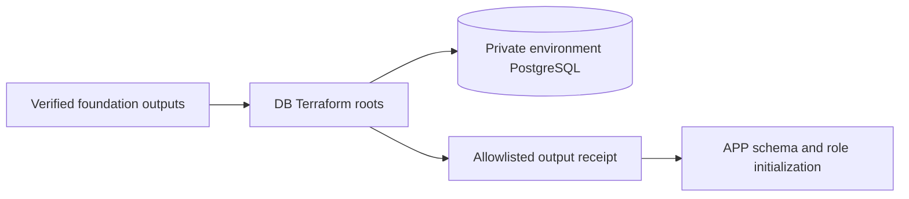

# Oficina database infrastructure

Run `pwsh -NoProfile -File tests/verify.ps1` for credential-free source verification.

This repository owns two independent private RDS PostgreSQL 16.15 environments. APP owns SQL migrations, role creation, views and runtime credentials. No cloud deployment is claimed by these source artifacts.

| Boundary | Configuration |
|---|---|
| Terraform / provider | Terraform 1.15.8; AWS 5.100.0; committed Linux/Windows locks |
| Database | One Single-AZ `db.t4g.micro` per root; encrypted 20 GiB gp3; no storage autoscaling, replica or proxy |
| Network / TLS | Isolated DB subnet inputs; SG-to-SG TCP 5432 only; `rds.force_ssl=1`; clients require `sslmode=verify-full` |
| Credentials | RDS-managed master secret; Terraform exposes its ARN only; APP initializes four restricted logins |
| Recovery | One-day automated backups; deletion protection; final snapshot required; no automatic engine upgrades |

Roots: `infra/environments/staging` and `infra/environments/production`; reusable module: `infra/modules/postgres`. Neither root accepts credentials or capacity overrides. Region is fixed to `us-east-1`; verified account/network/approved source SG references are required without release defaults.

[Architecture and role handoff](docs/architecture.md) explains ownership and connection budgeting. [Release runbook](docs/deployment.md) defines exact platform interfaces, protected environment settings and unresolved permissions. [I3 evidence](docs/evidence/i3-source-verification.md) records local checks and limitations.

CI checks PRs and branch pushes without AWS credentials. Protected develop/main pushes can invoke their matching private CodeBuild executor only with reviewed configuration, an open cloud window and immutable artifacts. Production additionally requires a successful staging promotion of the exact source bytes. Workflow source does not configure GitHub protection or grant deployment authorization.

## Technologies and Prerequisites

Technologies are listed in the configuration table above. Prerequisites: Terraform 1.15.8, PowerShell 7, provider dependencies for offline mocked validation, and reviewed foundation inputs before any cloud plan. DB has no API or Dockerfile; consumers use the [APP API contract](../Tech-challenge-15SOAT/docs/phase-3/api/contracts.md).

[Requirement/evidence matrix](docs/evidence/requirements.md) separates source checks from acceptance gaps. From the APP sibling checkout, run `python scripts/check-doc-links.py docs README.md` to check local links across all four owners. Historical R4 status files remain unchanged by this documentation audit.
