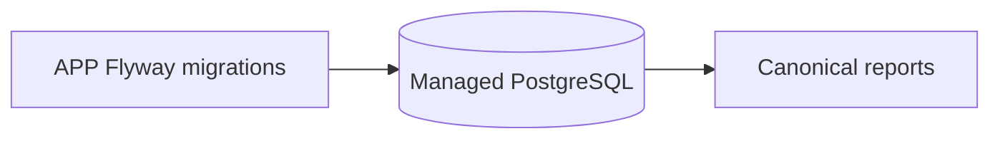

# Oficina database infrastructure

See [repository architecture](docs/architecture.md) and the APP [credential-free API snapshot](../Tech-challenge-15SOAT/docs/phase-3/api/contracts.md). No cloud deployment is represented as active.

Technologies: Terraform 1.15.8, AWS RDS PostgreSQL, and Secrets Manager references. Prerequisites: Terraform and reviewed environment inputs. This infrastructure repository has no API or Dockerfile.

This repository owns the managed PostgreSQL infrastructure boundary for Oficina staging and production. Terraform roots and database validation workflows arrive in Phase 3 task I3; `infra/` is reserved for that versioned infrastructure code.

APP remains the owner of Flyway migrations and database view contracts. Remote owner, visibility, protected branches, environment credentials, and deployment targets are release prerequisites and are intentionally unset in this local bootstrap.

There is currently no Terraform root beyond `infra/.gitkeep`, so do not claim `terraform validate` or `terraform test` as runnable here. From the root run `git diff --check` and `Get-ChildItem -Force infra`; APP owns Flyway validation. CI is [`.github/workflows/ci.yml`](.github/workflows/ci.yml), triggered by push and pull request for `main`, `master`, and `develop`, plus manual dispatch; it performs the same safe repository check. Deployment handoff requires a future reviewed Terraform root, protected CI, and an authorized R4 window; no cloud deployment is claimed.
