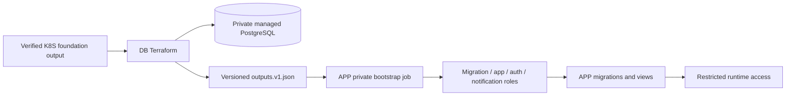

# Database ownership and bootstrap contract

DB owns RDS, DB subnet/parameter/security groups and managed-master credential metadata. It never fetches secret values and does not own relational schema or runtime credential initialization. Exported fields are exactly `dbEndpoint`, `dbPort`, `dbName`, `masterSecretArn`, `databaseSecurityGroupId`. The endpoint is the hostname without port. A managed-secret ARN is an approved reference, not a password.

The source SG object names app/auth/notification/bootstrap explicitly. IDs come from reviewed same-environment platform references. Shared source IDs are deduplicated into one ingress rule; a shared worker/function SG alone cannot enforce namespace/environment isolation. Platform CNI/network policies and distinct credentials remain necessary. Subnets must be isolated across two AZs; reference validation here cannot prove route-table isolation without an actual foundation review.

## APP role bootstrap

`contracts/bootstrap.v1.json` describes the handoff, and `scripts/check-bootstrap-receipt.ps1` checks the hash-bound APP receipt and pinned CA hash. DB does not substitute JSON validation for SQL permission tests.

The private APP bootstrap identity alone gets temporary `secretsmanager:GetSecretValue` for the exact managed-master ARN. Runtime identities get only their own secret ARN. RDS manages/rotates the master password; do not freeze it in tfvars, Terraform `secret_string`, output artifacts, command lines or logs.

APP performs idempotent role existence checks, generates/injects credentials through parameterized JDBC statements, and creates four separate non-superuser logins without CREATEDB/CREATEROLE. Migration owns the app schema and runs Flyway. App gets only required DML and sequence privileges. Auth gets schema USAGE and SELECT on `auth_cliente_snapshot`; notification gets SELECT on `notificacao_destinatario_snapshot`. Revoke PUBLIC CREATE/schema/default table privileges and bind default grants as the object owner.

APP's real PostgreSQL `DatabaseRolesTest` must prove function roles cannot SELECT/UPDATE base tables, runtime app cannot perform DDL, and migration can perform its owned-schema changes. Only after those tests and migrations succeed does APP publish the schema/view versions and four distinct environment/account-scoped secret ARNs. DB's checker rejects the master ARN, duplicate secrets, another environment/account, unexpected fields and changed CA/receipt bytes. Secret creation, SQL scripts and integration proof remain APP deliverables.

TLS clients use the actual RDS hostname, `sslmode=verify-full` and the SHA-256-pinned regional CA bundle from `https://truststore.pki.rds.amazonaws.com/us-east-1/us-east-1-bundle.pem`. The reviewed hash is recorded during APP packaging; no invented release digest is supplied. [AWS PostgreSQL TLS guidance](https://docs.aws.amazon.com/AmazonRDS/latest/UserGuide/PostgreSQL.Concepts.General.SSL.html).

## Connection budget to measure at R4

App maximum is five connections per pod, including reports/publisher: staging 2 pods = 10; production 4 pods = 20. A temporary extra rollout pod adds 5 in its environment. Add migration/bootstrap sessions and at most one JDBC connection per Lambda execution environment, including warm-container churn; concurrency quotas do not bound retained idle connections. Measure each instance's `SHOW max_connections`, `pg_stat_activity` and reserved capacity under the actual rollout/churn scenario before acceptance. No RDS connection limit or timeout is claimed as measured.

Single-AZ DB, shared NAT and shared EKS are study limitations. A stop is not zero-cost teardown. Deletion needs a reviewed protection change and final-snapshot name review (the default final name cannot be reused if that snapshot exists).
