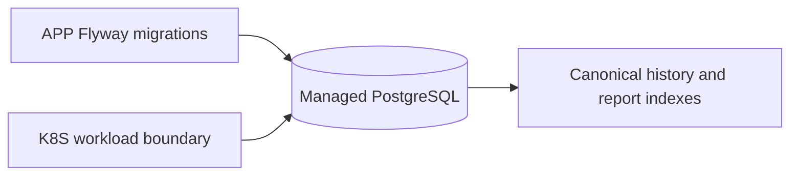

# Database architecture

This repository owns the managed PostgreSQL Terraform boundary. APP owns Flyway migrations, relational views and API behavior; K8S owns workload deployment. The consumer contract is APP [API snapshot](../../Tech-challenge-15SOAT/docs/phase-3/api/contracts.md). Technologies are Terraform 1.15.8, AWS RDS PostgreSQL and Secrets Manager references. There is no local API or Dockerfile.

Prerequisites are reviewed environment inputs; this repository currently has no Terraform root beyond `infra/.gitkeep`. From the root run `git diff --check` and `Get-ChildItem -Force infra`. CI is [`.github/workflows/ci.yml`](../.github/workflows/ci.yml), triggered by push and pull request for `main`, `master`, and `develop`, plus manual dispatch. Deployment handoff needs a reviewed Terraform root, protected CI and an authorized R4 window; no cloud deployment is claimed.
